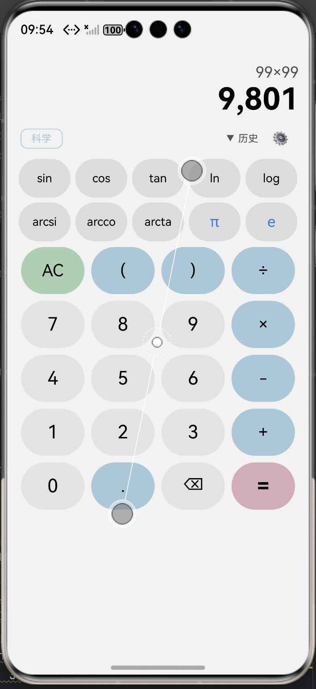

# OpenCalc HarmonyOS

OpenCalc 科学计算器的 HarmonyOS（ArkTS）移植版本。原 Android 项目由 [clementwzk/OpenCalc](https://github.com/clementwzk/OpenCalc) 开发。

> **原项目:** OpenCalc 3.2.1（12 个 Kotlin 文件，4,255 行）
> **鸿蒙版本:** 9 个 .ets 文件，~1,800 行 ArkTS
> **编译:** BUILD SUCCESSFUL（Hvigor 6.0.2 + SDK 12）

---

## 功能

| 功能 | 说明 |
|------|------|
| 四则运算 | `+` `-` `×` `÷` |
| 取模运算 | `#` |
| 幂运算 | `^`（支持小数指数） |
| 三角/反三角 | `sin` `cos` `tan` `arcsi` `arcco` `arcta` |
| 对数 | `ln`（自然）`log`（常用）`logtwo`（以2为底） |
| 指数 | `xp`（即 eˣ）`exp` |
| 阶乘 | `!`（Gamma 函数扩展支持非整数） |
| 平方根 | `sqrt` / `√` |
| 百分号 | `%`（自动转换为 `/100`） |
| 常量 | `π`（圆周率）`e`（自然常数） |
| 隐式乘法 | `2π` → `2*π`，`5(3+2)` → `5*(3+2)` |
| 括号自动补齐 | 缺少的 `)` 自动补上 |
| 角度/弧度切换 | 三角函数自动换算 |
| 科学模式 | 点击"科学"显示更多函数按钮 |
| 历史记录 | 左滑删除、点击回填、长按复制 |
| 3 种主题 | 默认 / AMOLED 纯黑 / Material You 暗色 |
| 错误提示 | 中文错误信息（除零/定义域/语法/无穷大/需实数） |
| 数字格式化 | 千分位 + 国际制/印度制 |

## 项目结构

```
harmonyos/
├── build-profile.json5          # 根构建配置
├── oh-package.json5             # 依赖管理
├── hvigorfile.ts                # Hvigor 入口
├── hvigor/
│   └── hvigor-config.json5      # Hvigor 版本（6.0.2）
├── AppScope/
│   └── app.json5                # 应用清单
└── entry/
    ├── build-profile.json5      # 模块构建配置
    ├── hvigorfile.ts
    ├── oh-package.json5
    └── src/main/
        ├── module.json5         # 模块清单（ability + permissions）
        ├── ets/
        │   ├── entryability/
        │   │   └── EntryAbility.ets       # 应用入口
        │   ├── pages/
        │   │   ├── Index.ets              # 启动页（跳转到 CalculatorPage）
        │   │   └── CalculatorPage.ets     # 主计算器页面
        │   ├── calculator/
        │   │   ├── Calculator.ets         # 递归下降解析器 + 数学函数
        │   │   ├── Expression.ets         # 表达式预处理
        │   │   └── NumberFormatter.ets    # 数字格式化
        │   ├── model/
        │   │   ├── Models.ets             # 数据模型 + 枚举
        │   │   └── ErrorFlags.ets         # 错误标志
        │   └── preferences/
        │       └── PreferencesStore.ets   # 偏好持久化
        └── resources/
            └── base/
                ├── profile/
                │   └── main_pages.json    # 页面路由
                ├── element/
                │   ├── string.json        # 字符串资源
                │   └── color.json         # 颜色资源
                └── media/
                    └── app_icon.png       # 应用图标
```

## 架构

```
CalculatorPage (@Entry)
  ├── DisplayPanel      显示屏（表达式 + 结果）
  ├── ToggleRow         模式切换栏（科学/基础 + 历史 + 设置）
  ├── ButtonGrid        按钮网格（5×N 布局）
  ├── HistoryPanel      历史列表面板（List + ForEach + 滑动删除）
  ├── SettingsPanel     设置面板（Toggle + 主题选择）
  └── AboutPanel        关于面板

CalculatorPage 依赖：
  ├── CalcEngine.evaluate()       计算引擎
  │     └── 递归下降解析器
  │           ├── parseExpression  → +/-
  │           ├── parseTerm        → ×/÷/#
  │           └── parseFactor      → 数字/括号/函数/^
  ├── Expression.getCleanExpression()  表达式预处理
  │     ├── 符号替换（×÷√log → */sqrt/logten）
  │     ├── 隐式乘法（2π → 2*π）
  │     ├── % 处理 → /100
  │     ├── ! 处理 → factorial()
  │     └── 括号补齐
  ├── NumberFormatter.format()    数字格式化
  └── PreferencesStore            偏好持久化
```

## 构建

### 前置条件

- DevEco Studio（提供 SDK + Hvigor + Node.js）
- macOS / Windows / Linux

### 命令行构建

```bash
export DEVECO_NODE="/Applications/DevEco-Studio.app/Contents/tools/node/bin/node"
export HVIGOR_HOME="/Applications/DevEco-Studio.app/Contents/tools/hvigor"
export JAVA_HOME="/Applications/DevEco-Studio.app/Contents/jbr/Contents/Home"
export DEVECO_SDK_HOME="/Applications/DevEco-Studio.app/Contents/sdk"

cd harmonyos
$DEVECO_NODE "$HVIGOR_HOME/bin/hvigorw.js" assembleHap
```

输出 HAP 位于 `entry/build/default/outputs/default/entry-default-unsigned.hap`。

### 在设备上安装

```bash
hdc shell bm install -p entry/build/default/outputs/default/entry-default-unsigned.hap
```

> 注意：需要先通过 DevEco Studio 配置签名证书。



## 与 Android 版本的差异

| 维度 | Android | HarmonyOS |
|------|---------|-----------|
| UI 框架 | ViewBinding XML | ArkUI 声明式 |
| 计算精度 | `java.math.BigDecimal`（任意精度） | `number`（IEEE 754，15-17 位） |
| 持久化 | `SharedPreferences` + Gson | `@ohos.data.preferences` + JSON |
| 活动 | 3 个 Activity（Main/Settings/About） | 1 个 @Entry 页面（面板覆盖层） |
| 主题 | 3 种（XML theme） | 3 种（@State 动态色值） |

## 迁移过程

本项目使用 `android-to-harmonyos-migration` 方法论完成迁移：

- **难度:** 🟢 Easy（0 个第三方库）
- **策略:** Spec-First → 原子任务 → 深度优先 → 逐模块编译
- **耗时:** 单 session
- **详见:** [spec/ARCH_ANALYSIS.md](../spec/ARCH_ANALYSIS.md) / [MIGRATION_SUMMARY.md](../MIGRATION_SUMMARY.md)

## 许可

原项目 [clementwzk/OpenCalc](https://github.com/clementwzk/OpenCalc) 使用 GPL-3.0 许可，本移植版本继承相同许可。
